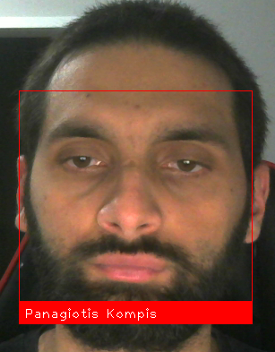

# BasicFaceRecognition

Basic Face Recognition Application that is using a camera.   

Make sure to check [this](https://github.com/ageitgey/face_recognition/tree/master/examples) for more examples.

## Steps
1. Install the latest Python3.
2. Pip install the necessary libraries.
3. Place any image (preferably .png) inside Persons folder with the name of the person, the name of the file will be used for the identification.
4. Have an available camera and simple execute the .py file.
5. Press q to quit from the application.

## Example

## Libaries used

- [Face Recognition](https://pypi.org/project/face-recognition)
- [OpenCV](https://pypi.org/project/opencv-python)
- [NumPy](https://pypi.org/project/numpy)

## Authors

- Kompis Panagiotis

## License

This project is licensed under the MIT License see the [LICENSE.md](https://github.com/PKompis/BasicFaceRecognition/blob/main/LICENSE) file for details.